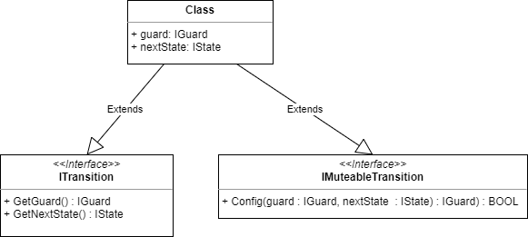
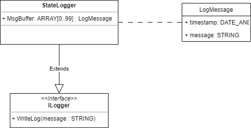

# Statemachine

This library provides a state framework,to implement simple statemachines easily.

## Install this package

Enter:

```sh
apax add @simatic-ax/statemachine
```

> to install this package you need to login into the GitHub registry. You'll find more information [here](https://github.com/simatic-ax/.sharedstuff/blob/main/doc/personalaccesstoken.md)

## Namespace

```sh
Simatic.Ax.StateFramework
```

## StatemachineController

### Class diagram


## States

### Class diagram states


## Transitions

### Class diagram transitions



## Guards

### Class diagram guards


### Available guards

* [AndGuard](#AndGuard)
* [BoolGuard](#BoolGuard)
* [CompareGuardLint](#CompareGuardLint)
* [CountGuard](#CountGuard)
* [OrGuard](#OrGuard)
* [TrueGuard](#TrueGuard)
* [XorGuard](#XorGuard)

* [BoolGuard](#BoolGuard)

### AndGuard

The `AndGuard` is a guard, that returns `TRUE`, if both conditions (Lhs `AND` Rhs) are `TRUE`.

Usage:

```iecst
USING Simatic.Ax.StateFramework;

PROGRAM SampleProgram
    VAR
        guard1 : AndGuard := (Lhs := timeoutGuard1, Rhs := countGuard1);
        timeoutGuard1 : TimeoutGuard := (Timeout := T#1500ms);
        countGuard1 : CountGuard := (Count := LINT#5);
    END_VAR
END_PROGRAM
```

### BoolGuard

The `BoolGuard` is a guard, that has a referecne to a boolean variable and returns `TRUE`, when the referenced variable is `TRUE`

> Note: REF_TO IOM varibales is not working in AX

Usage:

```iecst
USING Simatic.Ax.StateFramework;

PROGRAM SampleProgram
    VAR
        bValue : BOOL;
        guard1 : BoolGuard := (Value := REF(bValue));
    END_VAR
END_PROGRAM
```

### CompareGuardLint

The `CompareGuardLint` is a guard, compares a LINT variable (value) with a compare value (cv) and returns `TRUE` when the condition is fullfilled.

| Condition   | Description                           |             |
| ----------- | :------------------------------------ | :---------- |
| GT          | variable is greater than value        | value > cv  |
| EQ          | variable is equal to value            | value == cv |
| LT          | variable is less than value           | value < cv  |
| GE          | variable is greater or equal to value | value > cv  |
| LE          | variable is less or equal to value    | value > cv  |

> Note: REF_TO IOM variables is not working in AX

Usage:

```iecst
USING Simatic.Ax.StateFramework;

PROGRAM SampleProgram
    VAR
        value : LINT;
        guard1 : CompareGuardLint := (Value := REF(value), CompareToValue := LINT#500, Condition := Condition#GT);
    END_VAR
END_PROGRAM
```

### CountGuard

The count guard increments in every cycle the count value. When the value count has reached the value of the parameter `count`, the guard returns `TRUE`.

Usage:

```iecst
USING Simatic.Ax.StateFramework;

PROGRAM SampleProgram
    VAR
        value : LINT;
        guard1 : CountGuard := (Count := LINT#5);
    END_VAR

    // OR 
    guard1.Config(countValue := LINT#5);
END_PROGRAM
```

### OrGuard

The `OrGuard` is a guard, that returns `TRUE`, if at minimum one of both conditions (Lhs `OR` Rhs) are `TRUE`.

Usage:

```iecst
USING Simatic.Ax.StateFramework;

PROGRAM SampleProgram
    VAR
        guard1 : OrGuard := (Lhs := timeoutGuard1, Rhs := countGuard1);
        timeoutGuard1 : TimeoutGuard := (Timeout := T#1500ms);
        countGuard1 : CountGuard := (Count := LINT#5);
    END_VAR
END_PROGRAM
```

### TrueGuard

The `TrueGuard` is a guard, that always returns.

Usage:

```iecst
USING Simatic.Ax.StateFramework;

PROGRAM SampleProgram
    VAR
        guard1 : TrueGuard;
    END_VAR
END_PROGRAM
```

### XorGuard

The `XorGuard` is a guard, that returns `TRUE`, if exactly one condition (Lhs `XOR` Rhs) is `TRUE`.

Usage:

```iecst
USING Simatic.Ax.StateFramework;

PROGRAM SampleProgram
    VAR
        guard1 : XorGuard := (Lhs := timeoutGuard1, Rhs := countGuard1);
        timeoutGuard1 : TimeoutGuard := (Timeout := T#1500ms);
        countGuard1 : CountGuard := (Count := LINT#5);
    END_VAR
END_PROGRAM
```

## StateLogger

### Class diagram



## Example

## Contribution

Thanks for your interest in contributing. Anybody is free to report bugs, unclear documentation, and other problems regarding this repository in the Issues section or, even better, is free to propose any changes to this repository using Merge Requests.

## License and Legal information

Please read the [Legal information](LICENSE.md)
