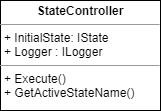
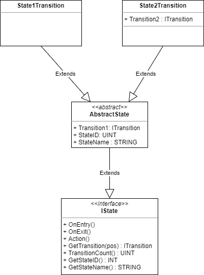
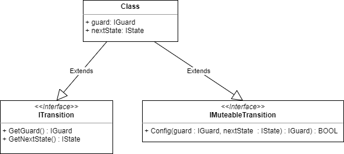
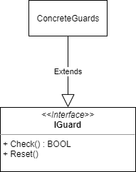
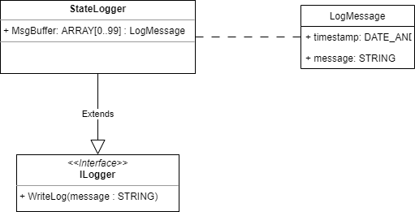

# Statemachine

This library provides a small object-oriented state machine framework for SIMATIC AX.

It is designed for simple single-path state machines with exactly one active state at a time.

## Install

```sh
apax add @simatic-ax/statemachine
```

To install this package, you need access to the GitHub package registry. More information is available [here](https://github.com/simatic-ax/.github/blob/main/docs/personalaccesstoken.md).

## Namespace

```iecst
Simatic.Ax.StateFramework
```

## What The Framework Does

The framework centers around `StateController`, `IState`, `ITransition`, and `IGuard`.

- `StateController` manages one active state.
- A state exposes zero or more outgoing transitions.
- A transition becomes active when its guard returns `TRUE`.
- The first transition whose guard evaluates to `TRUE` wins in a cycle.

This framework does not implement parallel states, fork/join semantics, or multiple active states.

## Controller Semantics

### Lifecycle order

The controller executes the state lifecycle in this order:

1. If no active state exists yet, the controller activates `InitialState`.
2. `OnEntry()` is called once when a state becomes active.
3. Transitions are evaluated in index order.
4. If no transition is taken, `Action()` is executed on the active state.
5. If a transition is taken, the current state executes `OnExit()`, the next state executes `OnEntry()`, and the next state's `Action()` may run in the same cycle.

### Error and stop behavior

- If `InitialState` is `NULL`, the controller enters `STATUS_NO_INITIALSTATE`.
- If a taken transition has no target state, the controller enters `STATUS_NO_NEXTSTATE`.
- If the active state has no outgoing transitions, the controller enters `STATUS_NO_TRANSITION`.
- Error states are latched. Once an error status is active, later `Execute()` calls do not recover automatically.
- `Restart()` terminates the current state and re-enters `InitialState`.

### Class diagram



## States

States implement `IState`. The provided `AbstractState` already handles:

- `StateID`
- `StateName`
- `StateStatus`
- one default transition slot via `Transition1`

For convenience, the library also provides:

- `State1Transition`
- `State2Transition`
- `State3Transition`

These helper classes support one, two, or three outgoing transitions.

### Class diagram



## Transitions

A transition connects:

- one `IGuard`
- one target `IState`

The controller evaluates transitions in order and switches to the first matching target state.

### Class diagram



## Guards

### Class diagram



### Available guards

- [AndGuard](#andguard)
- [BoolGuard](#boolguard)
- [CompareGuardLint](#compareguardlint)
- [CountGuard](#countguard)
- [NotGuard](#notguard)
- [OrGuard](#orguard)
- [TimeoutGuard](#timeoutguard)
- [TrueGuard](#trueguard)
- [XorGuard](#xorguard)

### AndGuard

`AndGuard` returns `TRUE` only if both child guards exist and both return `TRUE`.

```iecst
USING Simatic.Ax.StateFramework;

PROGRAM SampleProgram
    VAR
        timeoutGuard1 : TimeoutGuard := (Timeout := T#1500ms);
        countGuard1 : CountGuard := (Count := LINT#5);
        guard1 : AndGuard := (Lhs := timeoutGuard1, Rhs := countGuard1);
    END_VAR
END_PROGRAM
```

### BoolGuard

`BoolGuard` evaluates a `REF_TO BOOL`. It returns `FALSE` if the reference is `NULL`.

Note: `BoolGuard` is level-based. `Reset()` does not change its behavior.

```iecst
USING Simatic.Ax.StateFramework;

PROGRAM SampleProgram
    VAR
        bValue : BOOL;
        guard1 : BoolGuard := (Value := REF(bValue));
    END_VAR
END_PROGRAM
```

### CompareGuardLint

`CompareGuardLint` compares a referenced `LINT` value with a configured threshold.

Supported conditions in the current implementation:

| Condition | Meaning |
| --------- | ------- |
| `GT` | `value > compareToValue` |
| `EQ` | `value = compareToValue` |
| `LT` | `value < compareToValue` |
| `GE` | `value >= compareToValue` |
| `LE` | `value <= compareToValue` |

Note: Although the `Condition` enum also contains `NE`, the current `Check()` implementation does not handle it explicitly.

```iecst
USING Simatic.Ax.StateFramework;

PROGRAM SampleProgram
    VAR
        value : LINT;
        guard1 : CompareGuardLint := (
            Value := REF(value),
            CompareToValue := LINT#500,
            Condition := Condition#GT
        );
    END_VAR
END_PROGRAM
```

### CountGuard

`CountGuard` increments an internal counter on every `Check()` call. When the counter reaches `Count`, it returns `TRUE` once and resets its internal counter to zero.

Note: `Reset()` is currently a no-op. The guard keeps counting across cycles until it fires.

```iecst
USING Simatic.Ax.StateFramework;

PROGRAM SampleProgram
    VAR
        guard1 : CountGuard := (Count := LINT#5);
    END_VAR

    guard1.Config(countValue := LINT#5);
END_PROGRAM
```

### NotGuard

`NotGuard` negates the result of its child guard. If the child guard is `NULL`, it returns `FALSE`.

### OrGuard

`OrGuard` returns `TRUE` if at least one configured child guard returns `TRUE`.

If one side is `NULL`, the other side is evaluated on its own.

```iecst
USING Simatic.Ax.StateFramework;

PROGRAM SampleProgram
    VAR
        timeoutGuard1 : TimeoutGuard := (Timeout := T#1500ms);
        countGuard1 : CountGuard := (Count := LINT#5);
        guard1 : OrGuard := (Lhs := timeoutGuard1, Rhs := countGuard1);
    END_VAR
END_PROGRAM
```

### TimeoutGuard

`TimeoutGuard` uses `System.Timer.OnDelay`. It returns `TRUE` after the configured timeout has elapsed.

`Reset()` drops the timer input so the timeout starts again on the next `Check()` call.

### TrueGuard

`TrueGuard` always returns `TRUE`.

```iecst
USING Simatic.Ax.StateFramework;

PROGRAM SampleProgram
    VAR
        guard1 : TrueGuard;
    END_VAR
END_PROGRAM
```

### XorGuard

`XorGuard` returns `TRUE` if exactly one configured child guard returns `TRUE`.

If one side is `NULL`, the other side is evaluated on its own.

```iecst
USING Simatic.Ax.StateFramework;

PROGRAM SampleProgram
    VAR
        timeoutGuard1 : TimeoutGuard := (Timeout := T#1500ms);
        countGuard1 : CountGuard := (Count := LINT#5);
        guard1 : XorGuard := (Lhs := timeoutGuard1, Rhs := countGuard1);
    END_VAR
END_PROGRAM
```

## Logger

`StateLogger` is a simple ring buffer for log messages.

- It stores up to 100 entries in `MsgBuffer`.
- New entries overwrite old entries in a circular manner.
- The current controller implementation exposes `Logger : ILogger`, but it does not actively emit log messages yet.

### Class diagram



## Minimal Example

```iecst
USING Simatic.Ax.StateFramework;

PROGRAM SampleProgram
    VAR
        controller : StateController;
        startState : MyStartState := (StateID := 1, StateName := 'Start');
        nextState : MyNextState := (StateID := 2, StateName := 'Next');
        transition1 : Transition;
        guard1 : BoolGuard;
        switchState : BOOL;
    END_VAR

    guard1.Value := REF(switchState);
    transition1.Guard := guard1;
    transition1.NextState := nextState;
    startState.Transition1 := transition1;
    controller.InitialState := startState;

    controller.Execute();
END_PROGRAM

CLASS MyStartState EXTENDS AbstractState
    METHOD PUBLIC OVERRIDE OnExit
    END_METHOD

    METHOD PUBLIC OVERRIDE Action
    END_METHOD
END_CLASS

CLASS MyNextState EXTENDS AbstractState
    METHOD PUBLIC OVERRIDE OnExit
    END_METHOD

    METHOD PUBLIC OVERRIDE Action
    END_METHOD
END_CLASS
```

## Contribution

Thanks for your interest in contributing. Please use issues for bugs, unclear documentation, or feature requests, and open a merge request for proposed changes.

## License And Legal Information

Please read [LICENSE.md](LICENSE.md).
