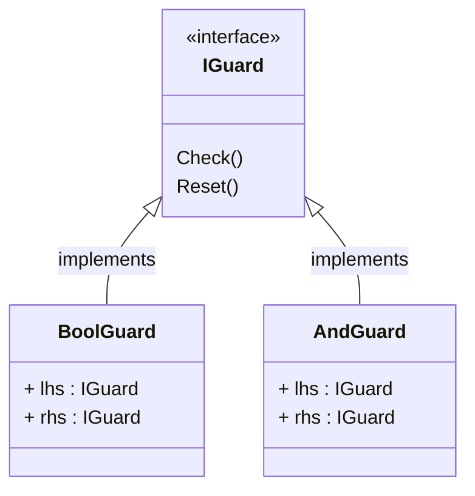
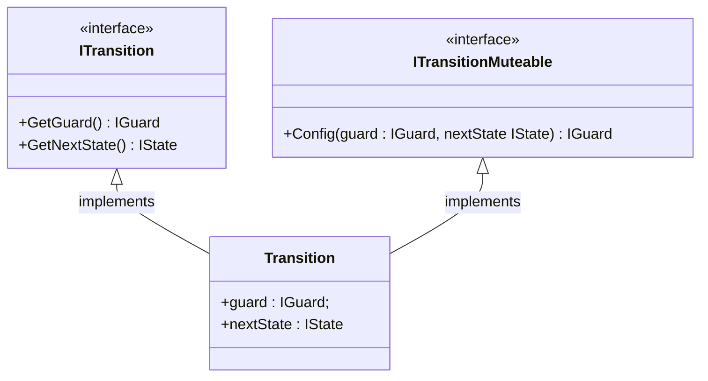
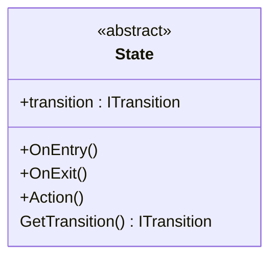

```mermaid
classDiagram
    class IGuard {
        <<interface>>
        Check()
        Reset()
    }

    class AndGuard {
        + lhs : IGuard
        + rhs : IGuard
    }
    class BoolGuard {
        + lhs : IGuard
        + rhs : IGuard
    }
    IGuard <|-- BoolGuard : implements
    IGuard <|-- AndGuard : implements
```

```mermaid
    classDiagram
        class ITransition {
            <<interface>>
            +GetGuard() IGuard
            +GetNextState()  IState
        }
        class ITransitionMuteable {
            <<interface>>
            +Config(guard : IGuard, nextState IState) IGuard
        }
        class Transition {
            +guard : IGuard;
            +nextState : IState
        }

        ITransition <|-- Transition : implements
        ITransitionMuteable <|-- Transition : implements
```

```mermaid
    classDiagram
        class State {
            <<abstract>>
            +transition : ITransition
            +OnEntry()
            +OnExit()
            +Action()
            GetTransition() ITransition
        }
```
